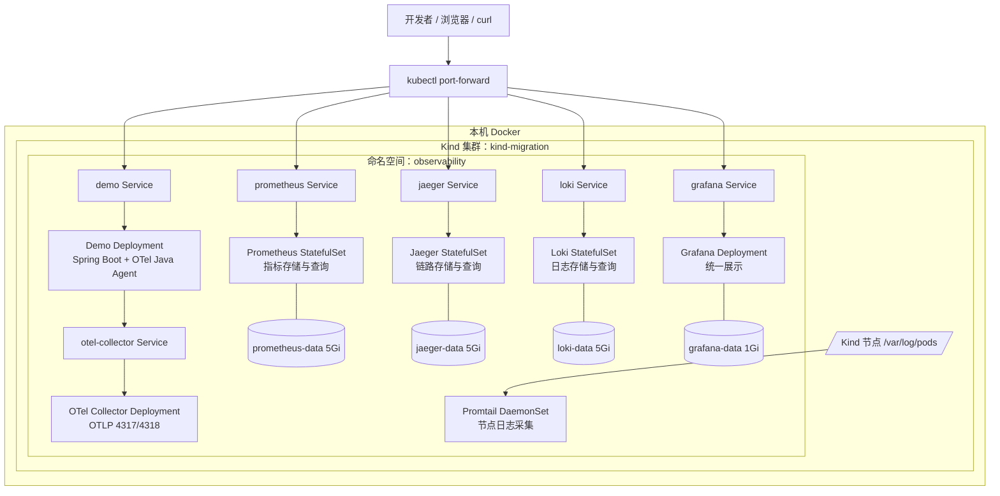
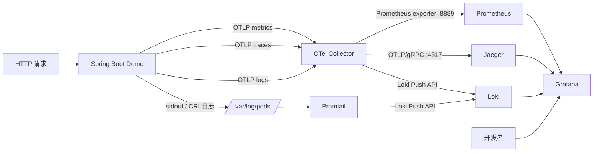

# Kind OpenTelemetry 中文统一计划设计

## 目的

把现有实施计划、继续执行计划、审计报告和 Hermes 在 Kind 集群上的验证结果整理为一份中文权威计划。新计划反映仓库的真实完成状态，同时保留尚未满足的验收要求，并以 Kind 作为目标部署环境。

## 文档关系

- 新计划保存为 `docs/superpowers/plans/2026-09-06-kind-otel-unified-plan.zh.md`。
- 旧计划和审计报告保留为历史资料，不删除、不覆盖。
- 新计划成为后续执行和验收的主要入口，并链接旧文档以便追溯。

## 状态表达

- 已有提交、当前源码和测试能够证明完成的步骤标记为 `[x]`。
- Hermes 在 Kind 集群上实际验证过的项目标记为 `[x]`，同时注明环境、结果和限制。
- 未在 Kind 目标环境证明完成的项目保持 `[ ]`，不能用静态渲染测试或历史的部分结果替代。
- Git 提交只能证明实现或历史验证发生过；对当前可运行状态的声明必须附新鲜验证命令和结果。

## 计划结构

统一计划按以下顺序组织：

1. 目标、架构、技术栈和全局约束。
2. 当前状态总览和证据规则。
3. Tasks 1–6 的实现步骤、提交证据和完成状态。
4. Task 7 的 Kind 端到端验证结果，包括成功项和 Promtail/Loki 限制。
5. 剩余验收：支持 Promtail 的环境验证、日志链路、PVC 持久化恢复和最终记录更新。
6. 最终完成标准、验证命令、回滚及交接要求。

## Kind 验证的边界

Kind 验证可以证明 Demo、Prometheus、Jaeger、Grafana 和主要 Chart 部署链路曾经工作。历史验证时 Promtail 被禁用且 Loki 没有采集到应用日志，因此当时不能证明日志链路或 PVC 重启恢复完成。Task 8 已在当前 Kind 集群补齐这两项动态验收。

## 完成标准

统一计划只有在以下条件全部满足后才能整体标记完成：

- 单元、Helm 渲染和脚本测试全部通过。
- 在 Kind 环境中解决 Promtail 的 inotify instance 限制，并验证 metrics、traces、logs 和 Grafana 数据源/仪表盘。
- 重启相关 Deployment、StatefulSet 和 DaemonSet 后，持久化数据仍可查询。
- 最终验证环境、命令摘要、限制和提交状态写回统一计划。

## 系统架构与部署解读

### 整体部署架构

整个系统部署在本机 Docker 承载的 Kind 集群中，业务和可观测组件统一位于 `observability` 命名空间。Kind 场景下所有业务 Service 都使用 `ClusterIP`，组件之间通过 Kubernetes Service DNS 通信；宿主机不直接绑定 NodePort，而是使用 `kubectl port-forward` 按需访问。



工作负载类型按状态特征划分：Demo、Collector 和 Grafana 可由控制器替换 Pod，因此使用 `Deployment`；Prometheus、Jaeger 和 Loki 需要稳定身份并挂载持久卷，因此使用单副本 `StatefulSet`；Promtail 必须在每个节点读取该节点的容器日志，因此使用 `DaemonSet`。当前 Kind 集群只有一个控制平面节点，所以 Promtail 实际运行一个 Pod。

### 模块架构与三信号流向



| 模块 | 核心职责 | 输入 | 输出或依赖 |
|---|---|---|---|
| Demo | 提供示例 HTTP API，并由 OTel Java Agent 自动产生遥测数据 | 用户 HTTP 请求 | OTLP 三信号发往 Collector；标准输出由容器运行时写入节点日志 |
| OTel Collector | 接收、限流、补充资源属性、批处理并路由三信号 | Demo 的 OTLP/gRPC 或 OTLP/HTTP | 指标暴露给 Prometheus；链路发往 Jaeger；OTLP 日志发往 Loki |
| Prometheus | 拉取并保存时序指标，执行 recording/alert rules | Collector `:8889` 和 Demo `/actuator/prometheus` | PromQL API，供 Grafana 和开发者查询 |
| Jaeger | 接收、持久化并查询分布式链路 | Collector 的 OTLP/gRPC | Jaeger UI/API，供 Grafana 和开发者查询 |
| Promtail | 发现 Kubernetes Pod，解析 CRI 日志并添加 namespace、pod、container、app 标签 | Kind 节点 `/var/log/pods` | Loki Push API |
| Loki | 保存并查询结构化标签关联的应用日志 | Collector OTLP 日志和 Promtail CRI 日志 | LogQL API，供 Grafana 和开发者查询 |
| Grafana | 将指标、链路和日志统一展示，并提供预置仪表盘 | Prometheus、Jaeger、Loki Service | Web UI、数据源代理和跨信号跳转 |

日志存在两条入口：应用由 Java Agent 发出的 OTLP logs 经过 Collector；容器标准输出则由 Promtail 从节点日志采集。两条链路最终都进入 Loki，Promtail 链路同时证明 Kubernetes 容器日志采集能力。

### Helm 如何部署整个系统

仓库使用单个 `otel-observability` Helm Chart 管理全部资源。部署时 Helm 按从左到右的顺序合并 values：基础配置来自 `values.yaml`，本地公共覆盖来自 `values-minikube.yaml`，最后由 `values-kind.yaml` 将对外 Service 改为 `ClusterIP`、启用 Promtail，并让 `--create-namespace` 管理 `observability` 命名空间。实际命令为：

```bash
helm upgrade --install otel-observability helm/otel-observability \
  --namespace observability \
  --create-namespace \
  -f helm/otel-observability/values-minikube.yaml \
  -f helm/otel-observability/values-kind.yaml
```

Helm 读取 `Chart.yaml`、合并后的 values、`templates/` 和 Grafana dashboard 文件，渲染出 Deployment、StatefulSet、DaemonSet、Service、ConfigMap、RBAC 与 PVC，然后交给 Kubernetes API。`global.namespace` 在 Kind 覆盖中设为空字符串，使模板通过 `.Release.Namespace` 选择 `observability`，避免 Chart 内 Namespace 资源与 Helm `--create-namespace` 的所有权冲突。

Demo 镜像需要先在本机完成 Maven 构建和 Docker 构建，再加载到 Kind 节点；其他组件使用固定版本的上游镜像：

```bash
mvn package
docker build -t otel-springboot-demo:local .
kind load docker-image otel-springboot-demo:local --name migration
```

Dockerfile 把应用 JAR 和 OpenTelemetry Java Agent 一起放入镜像。Deployment 通过 `JAVA_TOOL_OPTIONS=-javaagent:/otel/opentelemetry-javaagent.jar` 激活 Agent，并通过 `OTEL_EXPORTER_OTLP_ENDPOINT=http://otel-collector:4317` 使用集群内 Service 找到 Collector。

### 各组件如何部署起来

#### Demo

- `app-deployment.yaml` 创建单副本 Deployment，镜像默认是已加载到 Kind 的 `otel-springboot-demo:local`。
- 环境变量配置服务名、环境、版本、OTLP 地址和 5 秒指标导出周期；Java Agent 自动采集 HTTP、JVM、指标和链路。
- readiness/liveness 都访问 `/actuator/health`，只有健康 Pod 才会进入 `demo` Service 后端。
- `app-service.yaml` 创建端口 8080 的 ClusterIP Service；`app=otel-springboot-demo` 标签供 Promtail 生成 Loki 的 `app` 标签。

#### OpenTelemetry Collector

- `collector-configmap.yaml` 定义 OTLP gRPC/HTTP receivers、memory limiter、resource、batch processors，以及 Prometheus、Jaeger、Loki exporters。
- `collector-deployment.yaml` 将 ConfigMap 挂载到 `/conf/config.yaml`；ConfigMap checksum 写入 Pod annotation，配置变化会触发滚动更新。
- `collector-service.yaml` 暴露 4317、4318、8889 和 13133。Demo 写入 4317/4318，Prometheus 拉取 8889，探针检查 13133。
- Jaeger 与 Loki 暂时不可用时，Collector 的队列和 retry 配置负责重试；memory limiter 和 batch 控制内存与发送批次。

#### Prometheus

- `prometheus-statefulset.yaml` 创建单副本 StatefulSet，并把 `prometheus-data` PVC 挂载到 `/prometheus`。
- `prometheus-configmap.yaml` 每 5 秒抓取 Collector exporter 和 Demo Actuator；`prometheus-rules-configmap.yaml` 提供 recording rules 与本地告警规则。
- Service 暴露 9090；readiness 使用 `/-/ready`，liveness 使用 `/-/healthy`；TSDB 保留期默认 7 天。

#### Jaeger

- `jaeger-statefulset.yaml` 使用 all-in-one 镜像和 Badger 本地存储，关闭临时模式，将数据目录挂载到 `jaeger-data` PVC。
- 开启 OTLP 接收，Collector 通过 `jaeger:4317` 发送 traces；Service 同时暴露 4317、4318 和 UI 16686。
- UI 根路径用于存活与就绪探测；当前采用单节点本地 Badger，适合本地开发和验收，不用于生产高可用部署。

#### Loki

- `loki-configmap.yaml` 配置单节点、内存 ring、TSDB schema v13、filesystem object store、compactor 和 7 天保留期。
- `loki-statefulset.yaml` 把配置挂载到 `/etc/loki`，把 `loki-data` PVC 挂载到 `/loki`；`/ready` 用作探针。
- ClusterIP Service 暴露 3100，供 Collector、Promtail、Grafana 和查询脚本使用。

#### Promtail

- `promtail-daemonset.yaml` 同时生成 ConfigMap、DaemonSet、ServiceAccount、ClusterRole 和 ClusterRoleBinding。
- RBAC 只允许读取和监视 Pod、Node 及 Node proxy；Kubernetes service discovery 找到 Pod 后，relabel 配置生成 node、namespace、pod、container、app 与日志路径信息。
- DaemonSet 以只读方式挂载宿主节点 `/var/log/pods`，用 CRI pipeline 解析日志，再推送到 `http://loki:3100/loki/api/v1/push`。
- `HOSTNAME` 显式取 `spec.nodeName`，配合 `__host__` 只采集当前节点目标。Kind 节点还需要足够的 `fs.inotify.max_user_instances`，当前验收值为 1024。

#### Grafana

- `grafana-configmaps.yaml` 预置 Prometheus、Jaeger、Loki 三个数据源、dashboard provider 和 OpenTelemetry Demo dashboard。
- `grafana-deployment.yaml` 挂载这些 ConfigMap，并把运行数据写入 `grafana-data` PVC；默认管理员凭据来自 values 中的 `admin/admin`。
- Grafana 通过集群内 Service DNS 访问三个后端；`/api/health` 用于 readiness/liveness，Service 暴露 3000。

#### 持久卷、Service 与可选 Ingress

- `pvc.yaml` 在 `persistence.enabled=true` 时创建四个 `ReadWriteOnce` PVC：Prometheus、Jaeger、Loki 各 5Gi，Grafana 1Gi，统一使用 Kind 的 `standard` StorageClass。
- Service 为 Pod 提供稳定 DNS，使 Kubernetes 可以并行启动所有组件；客户端不需要依赖 Pod IP 或严格启动顺序。
- `ingress.yaml` 默认关闭。当前 Kind 验收使用 ClusterIP 与 port-forward，不依赖 Ingress Controller；只有显式设置 `ingress.enabled=true` 才生成 Demo、Grafana、Prometheus 和 Jaeger 的域名路由。

### 创建顺序与运行时收敛

Helm 模板文件的排列不代表严格启动顺序。Helm 把资源提交给 Kubernetes 后，各控制器会并行创建 Pod、绑定 PVC 和配置 Service。系统依靠以下机制最终收敛：

1. Service 在后端 Pod 尚未 Ready 时也能先建立稳定 DNS。
2. PVC 绑定完成后，三个 StatefulSet 和 Grafana 才能挂载数据目录启动。
3. readiness probe 决定 Pod 是否进入 Service Endpoint；liveness probe 负责重启失去响应的容器。
4. Collector 对 Jaeger/Loki 使用发送队列与重试，Prometheus 持续按抓取周期重试目标，Promtail 持续发现 Pod 并重试推送。
5. `scripts/verify-observability.sh` 等待命名空间内所有 Pod Ready 后，再依次验证 Demo、四类指标、Jaeger 服务、非空 Loki 日志以及 Grafana 三个数据源。

因此部署成功不以“Helm 命令退出 0”单独判断，而以工作负载 Ready、三信号可查询、Grafana 数据源可用以及重启后 PVC 数据仍存在作为完整验收标准。

## 组件访问设计

Kind 部署默认使用 ClusterIP，不直接暴露宿主机端口。交互式访问统一使用 `kubectl port-forward -n observability`：Demo `svc/demo:8080`、Grafana `svc/grafana:3000`、Prometheus `svc/prometheus:9090`、Jaeger `svc/jaeger:16686`、Loki `svc/loki:3100`。Collector 仅供遥测发送，集群内使用 `otel-collector.observability.svc.cluster.local:4317/4318`；需要宿主机调试时分别转发 4317 和 4318。Promtail 没有用户界面，通过 `kubectl logs -n observability daemonset/promtail` 和 `kubectl port-forward -n observability daemonset/promtail 19080:9080` 检查。

统一计划必须给出每个组件的集群内地址、port-forward 命令、本机 URL、Grafana 默认凭据和健康/查询入口。

## 范围限制

初始阶段只整合计划文档；经用户批准执行 Task 8 后，允许修改 Helm Chart、验证脚本和测试，并在现有 Kind 集群部署验证。历史文档和无关集群不得删除。
